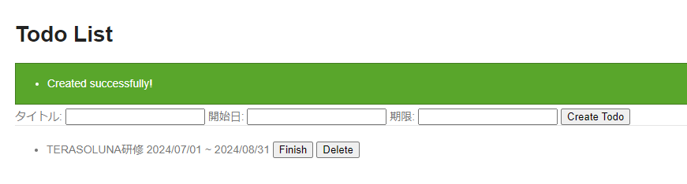

# todoサンプル拡張課題
## 日付操作
### 概要
Javaで日付を表すクラスは`java.util.Date`などいろいろありますが、ここでは日時計算で便利な`java.time.LocalDate`の使い方をいくつか説明します。  
また今回は省略しますが、時間を扱う場合は`java.time.LocalTime`、日時を扱う場合は`java.time.LocalDateTime`がそれぞれ用意されており、基本的に使い方は同じです。

- 日時取得
  ```java
  // 現在日付を取得
  LocalDate nowLocalDate = LocalDate.now();

  // 指定した日時を取得
  LocalDate fixLocalDate = LocalDate.of(2024, 7, 1);
  ```

- 日時 ⇒ 文字列の変換
  ```java
  // formatterの各設定については参考リンクを参照
  DateTimeFormatter formatter1 = DateTimeFormatter.ofPattern("uuuu/MM/dd")
          .withLocale(Locale.JAPANESE).withResolverStyle(ResolverStyle.STRICT);

  DateTimeFormatter formatter2 = DateTimeFormatter.ofPattern("d-M-uuuu")
          .withLocale(Locale.JAPANESE).withResolverStyle(ResolverStyle.STRICT);

  LocalDate localDate = LocalDate.of(2024, 7, 1);

  // 2024/07/01
  String str1 = formatter1.format(localDate);

  // 1-7-2024
  String str2 = formatter2.format(localDate);
  ```

- 文字列 ⇒ 日時の変換
  ```java
  DateTimeFormatter formatter = DateTimeFormatter.ofPattern("uuuu/MM/dd")
          .withLocale(Locale.JAPANESE).withResolverStyle(ResolverStyle.STRICT);

  String str = "2024/07/01";

  // 引数の文字列がformatterで指定したフォーマットに合わない場合、DateTimeParseExceptionが発生する
  LocalDate localDate = formatter.parse(str);
  ```

- 日時の計算
  ```java
  // 2024/07/01
  LocalDate localDate = LocalDate.of(2024, 7, 1);

  // 2025/07/01
  localDate = localDate.plusYears(1);

  // 2025/04/01
  localDate = localDate.minusMonths(3);

  // 2025/04/11
  localDate = localDate.plusDays(10);
  ```

- 日時の比較
  ```java
  LocalDate localDate1 = LocalDate.of(2024, 7, 1);
  LocalDate localDate2 = LocalDate.of(2024, 7, 2);

  // 2024/07/01 < 2024/07/02なのでtrue
  boolean before = localDate1.isBefore(localDate2);

  // 2024/07/01 > 2024/07/02ではないのでfalse
  boolean after = localDate1.isAfter(localDate2);

  // 2024/07/01 = 2024/07/02ではないのでfalse
  boolean equal = localDate1.equals(localDate2);
  ```

### 演習
TODOに開始日、期限の項目を追加しよう！

### 画面イメージ
- 入力Formに開始日、期限を追加
  
- TODOの一覧にも開始日、期限を追加
  
- 開始日が期限より後になっている場合はエラーメッセージを表示
  

### 事前準備
1. `TodoForm.java`に項目、Getter/Setterを追加する
   ```java
   public class TodoForm implements Serializable {
       ...

       private String startDate;

       private LocalDate limitDate;

       ...

       public String getStartDate() {
           return startDate;
       }

       public void setStartDate(String startDate) {
           this.startDate = startDate;
       }

       public LocalDate getLimitDate() {
           return limitDate;
       }

       public void setLimitDate(LocalDate limitDate) {
           this.limitDate = limitDate;
       }
   }
   ```

> [!IMPORTANT]  
> 本来日付項目に`String`型を用いるか、`LocalDate`型を用いるかは統一するべきだが、今回は研修の都合上両方を採用している

2. `Todo.java`に項目、Getter/Setterを追加する
   ```java
   public class Todo implements Serializable {
       ...

       private LocalDate startDate;

       private LocalDate limitDate;

       ...

       public LocalDate getStartDate() {
           return startDate;
       }

       public void setStartDate(LocalDate startDate) {
           this.startDate = startDate;
       }

       public LocalDate getLimitDate() {
           return limitDate;
       }

       public void setLimitDate(LocalDate limitDate) {
           this.limitDate = limitDate;
       }
   }
   ```

3. 開始日はBeanマッピングの対象外として手動で値の詰め替えを行うため、`TodoMapper.java`にアノテーションを追加する
   ```java
   @Mapper
   public interface TodoMapper {
       @Mapping(target = "createdAt", ignore = true)
       @Mapping(target = "finished", ignore = true)
       @Mapping(target = "startDate", ignore = true)
       Todo map(TodoForm form);
   }
   ```

4. `list.html`に入力項目、出力項目を追加する
   - 入力項目
   ```html
   <form action="/todo/create" th:action="@{/todo/create}" method="post">
       <label>タイトル:</label>
       <input type="text" th:field="${todoForm.todoTitle}" />
       <label>開始日:</label>
       <input type="text" th:field="${todoForm.startDate}" />
       <label>期限:</label>
       <input type="text" th:field="${todoForm.limitDate}" />
       <span id="todoTitle.errors" th:errors="${todoForm.todoTitle}" class="text-error">size must be between 1 and 30</span>
       <button>Create Todo</button>
   </form>
   ```

   - 出力項目
   ```html
   <li th:each="todo : ${todos}">
       <span th:class="${todo.finished} ? 'strike'" th:text="${todo.todoTitle}">Send a e-mail</span>
       <span th:text="${todo.startDate}">2024/07/01</span>
       <span>~</span>
       <span th:text="${todo.limitDate}">2024/07/31</span>
       ...
   </li>
   ```

> [!IMPORTANT]  
> 日付の入力項目は`type="date"`とすることでカレンダーによる入力も出来るが、今回は研修の都合上`type="text"`としている
>
> 

### 進め方
1. 追加した項目をSQLに反映する
2. `TodoController.java`のcreateメソッド内で`TodoForm.java`から`Todo.java`へ開始日を詰め替える処理を追加する
3. `TodoServiceImpl.java`のcreateメソッド内で開始日と期限を比較し、開始日＞期限となる場合は以下のメッセージを設定した`BusinessException.java`をスローする

   > 開始日が期限より後になっています.
4. 一覧の日付が`uuuu-MM-dd`形式になっているので、`uuuu/MM/dd`で表示するように`list.html`を修正する

### ポイント
- `TodoForm.java`から`Todo.java`への開始日の詰め替えは型が異なるため型変換が必要になります
- 開始日と期限の比較は以下となるように注意してください
  - 開始日＞期限：エラー
  - 開始日＝期限：OK
  - 開始日＜期限：OK
- 一覧の日付フォーマットの変更にはThymeleafのダイアレクトという機能を利用してください
- 日付のフォーマットは`uuuu/MM/dd`としてください  
  余裕のある人は`yyyy/MM/dd`との違いも調べてみてください

### 参考
- [TERASOLUNAガイドライン - 7.3. 日付操作(JSR-310 Date and Time API)](https://terasolunaorg.github.io/guideline/current/ja/ArchitectureInDetail/GeneralFuncDetail/DateAndTime.html)
- [Qiita - Java8での日付操作](https://qiita.com/motoki1990/items/bf5a25c77f28835b73ed)
- [Qiita - \[Java\] ResolverStyle.LENIENTを利用して日時をいい感じに扱う](https://qiita.com/m_green14/items/d1eec297a9c0d85bcdf1)
- [DateTimeFormatter JavaDoc](https://docs.oracle.com/javase/jp/8/docs/api/java/time/format/DateTimeFormatter.html)
