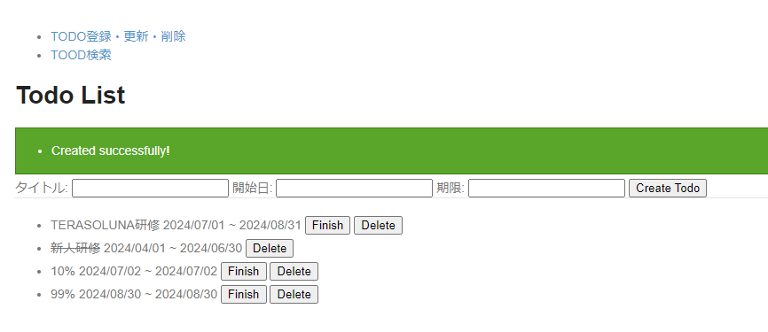
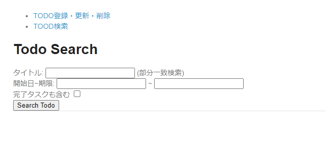
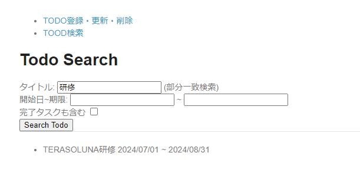
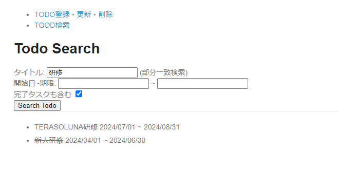
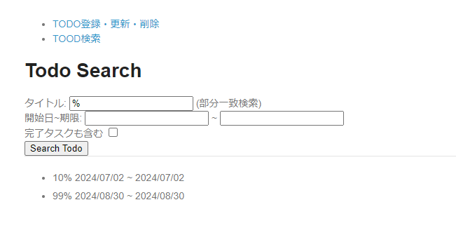
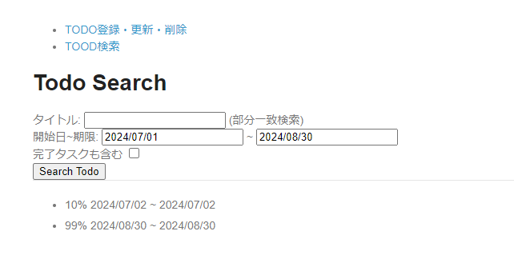
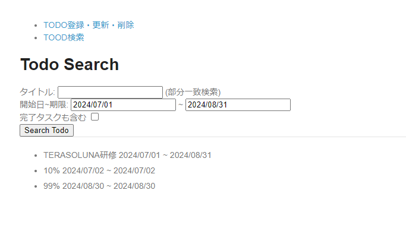

# todoサンプル拡張課題
## データベースアクセス
### 概要
TODOの検索画面を作成しよう！

### 画面イメージ
- 検索用のデータ登録サンプル

  
- 検索ページの初期表示

  
- タイトル「研修」で検索した結果

  
- タイトル「研修」、「完了タスクも含む」で検索した結果

  
- タイトル「%」で検索した結果

  
- 開始日「2024/07/01」、期限「2024/08/30」で検索した結果

  
- 開始日「2024/07/01」、期限「2024/08/31」で検索した結果

  

### 事前準備
1. `com.example.todo.domain.repository.todo`パッケージに`TodoCriteria.java`を作成する
   ```java
   package com.example.todo.domain.repository.todo;
   
   import java.io.Serializable;
   import java.time.LocalDate;
   
   public class TodoCriteria implements Serializable {
   
       private static final long serialVersionUID = 1L;
   
       private String todoTitle;
   
       private boolean finished;
   
       private LocalDate startDate;
   
       private LocalDate limitDate;
   
       // Getter/Setterは省略
   }
   ```
2. `TodoRepository.java`にメソッドを追加する
   ```java
   public interface TodoRepository {
   
       ...
   
       Collection<Todo> findByCriteria(TodoCriteria criteria);
   }
   ```

3. `TodoService.java`と`TodoServiceImpl.java`にメソッドを追加する
   ```java
   public interface TodoService {
   
       ...
   
       Collection<Todo> findByCriteria(TodoCriteria criteria);
   }
   ```

   ```java
   public class TodoServiceImpl implements TodoService {
   
       ...
   
       @Override
       public Collection<Todo> findByCriteria(TodoCriteria criteria) {
           return todoRepository.findByCriteria(criteria);
       }
   }
   ```

4. `com.example.todo.app.search`パッケージに`SearchForm.java`を作成する
   ```java
   package com.example.todo.app.search;
   
   import java.io.Serializable;
   import java.time.LocalDate;
   import org.springframework.format.annotation.DateTimeFormat;
   import jakarta.validation.constraints.Size;
   
   public class SearchForm implements Serializable {
   
       private static final long serialVersionUID = 1L;
   
       @Size(max = 30)
       private String todoTitle;
   
       private boolean finished;
   
       @DateTimeFormat(pattern = "uuuu/MM/dd")
       private LocalDate startDate;
   
       @DateTimeFormat(pattern = "uuuu/MM/dd")
       private LocalDate limitDate;
   
       // Getter/Setterは省略
   }
   ```

5. `com.example.todo.app.search`パッケージに`SearchMapper.java`を作成する
   ```java
   package com.example.todo.app.search;
   
   import org.mapstruct.Mapper;
   import com.example.todo.domain.repository.todo.TodoCriteria;
   
   @Mapper
   public interface SearchMapper {
   
       TodoCriteria map(SearchForm form);
   }
   ```

6. `com.example.todo.app.search`パッケージに`SearchController.java`を作成する
   ```java
   package com.example.todo.app.search;
   
   import java.util.Collection;
   import org.springframework.stereotype.Controller;
   import org.springframework.ui.Model;
   import org.springframework.web.bind.annotation.GetMapping;
   import org.springframework.web.bind.annotation.ModelAttribute;
   import org.springframework.web.bind.annotation.PostMapping;
   import org.springframework.web.bind.annotation.RequestMapping;
   import com.example.todo.domain.model.Todo;
   import com.example.todo.domain.repository.todo.TodoCriteria;
   import com.example.todo.domain.service.todo.TodoService;
   import jakarta.inject.Inject;
   
   @Controller
   @RequestMapping("search")
   public class SearchController {
   
       @Inject
       TodoService todoService;
   
       @Inject
       SearchMapper beanMapper;
   
       @ModelAttribute
       public SearchForm setUpForm() {
           SearchForm form = new SearchForm();
           return form;
       }
   
       @GetMapping
       public String init() {
           return "search/search";
       }
   
       @PostMapping
       public String result(SearchForm form, Model model) {
           TodoCriteria criteria = beanMapper.map(form);
           Collection<Todo> todos = todoService.findByCriteria(criteria);
           model.addAttribute("todos", todos);
           return "search/search";
       }
   }
   ```

7. `views/common/layout`フォルダに`header.html`を作成する
   ```html
   <!DOCTYPE html>
   <html xmlns:th="http://www.thymeleaf.org" th:fragment="header">
   <head>
   <title>header</title>
   </head>
   <body>
       <div th:fragment="header" th:remove="tag">
           <ul>
               <li><a th:href="@{/todo/list}">TODO登録・更新・削除</a></li>
               <li><a th:href="@{/search}">TOOD検索</a></li>
           </ul>
       </div>
   </body>
   </html>
   ```

8. `list.html`に`header.html`のフラグメント呼び出しを追加する
   ```html
   <body>
       <div id="header" th:replace="~{common/layout/header :: header}"></div>
       <h1>Todo List</h1>
       ...
   </body>
   ```

9. `views/search`フォルダに`search.html`を作成する
   ```html
   <!DOCTYPE html>
   <html xmlns:th="http://www.thymeleaf.org">
   
   <head>
       <meta http-equiv="Content-Type" content="text/html; charset=UTF-8">
       <title>Todo Search</title>
       <link rel="stylesheet" href="../../../resources/app/css/styles.css" th:href="@{/resources/app/css/styles.css}">
   </head>
   
   <body>
       <div id="header" th:replace="~{common/layout/header :: header}"></div>
       <h1>Todo Search</h1>
       <div id="searchForm">
           <div th:if="${resultMessages} != null" class="alert alert-success"
               th:class="|alert alert-${resultMessages.type}|">
               <ul>
                   <li th:each="message : ${resultMessages}" th:text="${message.text}"></li>
               </ul>
           </div>
           <form action="/search" th:action="@{/search}" method="post" th:object="${searchForm}">
               <label>タイトル:</label>
               <input type="text" th:field="*{todoTitle}" />
               <span>(部分一致検索)</span>
               <br>
               <label>開始日~期限:</label>
               <input type="text" th:field="*{startDate}" />
               <span>~</span>
               <input type="text" th:field="*{limitDate}" />
               <br>
               <label>完了タスクも含む</label>
               <input type="checkbox" th:field="*{finished}">
               <br>
               <span id="todoTitle.errors" th:errors="*{todoTitle}" class="text-error"></span>
               <span id="startDate.errors" th:errors="*{startDate}" class="text-error"></span>
               <span id="limitDate.errors" th:errors="*{limitDate}" class="text-error"></span>
               <button>Search Todo</button>
           </form>
       </div>
       <hr />
       <div id="todoList">
           <ul th:remove="all-but-first">
               <li th:each="todo : ${todos}">
                   <span th:class="${todo.finished} ? 'strike'" th:text="${todo.todoTitle}"></span>
                   <span th:text="${#temporals.format(todo.startDate, 'uuuu/MM/dd')}"></span>
                   <span>~</span>
                   <span th:text="${#temporals.format(todo.limitDate, 'uuuu/MM/dd')}"></span>
               </li>
           </ul>
       </div>
   </body>
   
   </html>
   ```

### 進め方
1. 以下の条件で検索できるように`TodoRepository.xmlに`SQLを追加する
   - タイトルは入力された場合、部分一致検索
   - 開始日は入力された場合、開始日が入力値以降のデータがヒット
   - 期限は入力された場合、期限が入力値以前のデータがヒット
   - 完了タスクも含むにチェックが入っていない場合、finishedがfalseのデータのみヒット

### ポイント
- 実装が完了した後、画面イメージに従って動作確認をしてみてください
- 部分一致検索にはLIKE式を使います  
  LIKE式において`%`は任意の文字列を意味するワイルドカード文字として扱われるため、そのまま`WHERE todo_title LIKE %`で検索するとすべての値がヒットしてしまいます
  このような特殊な扱いの文字を通常の文字として扱うことをエスケープと呼びます

### 参考
- https://terasolunaorg.github.io/guideline/current/ja/ArchitectureInDetail/DataAccessDetail/DataAccessMyBatis3.html
- https://www.postgresql.jp/docs/9.0/functions-matching.html