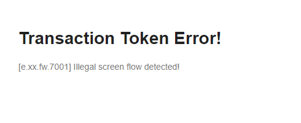
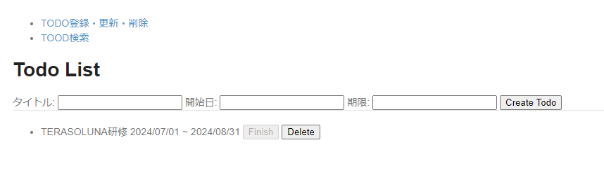
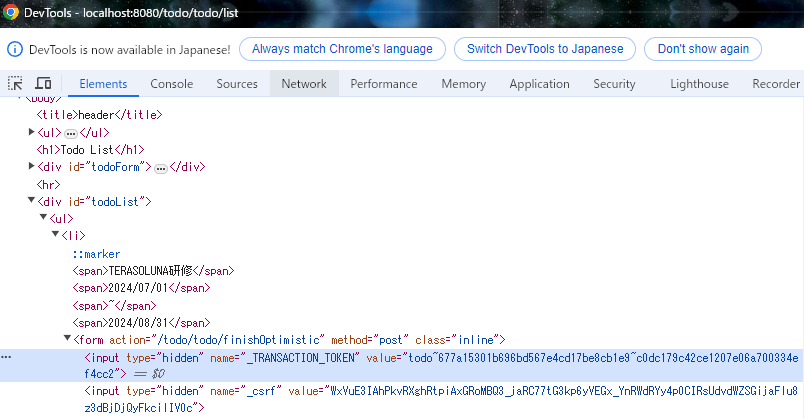

# todoサンプル拡張課題
## 二重送信防止
### 概要
二重送信防止を実装してみよう！

### 画面イメージ
- トランザクショントークンチェックエラー発生時
  

- Finishボタン非活性時
  

### 事前準備
1. [jquery-3.7.1.min.js](jquery-3.7.1.min.js)をそのまま`src/main/webapp/resources/vendor/js/jquery`フォルダに配置する

2. `src/main/webapp/resources/app/js/todo`フォルダに`list.js`を作成する

3. `list.html`にJavaScriptの読み込みを追加する
   ```html
   <head>
       <meta http-equiv="Content-Type" content="text/html; charset=UTF-8">
       <title th:text="#{title.todo.list}">Todo List</title>
       <link rel="stylesheet" href="../../../resources/app/css/styles.css" th:href="@{/resources/app/css/styles.css}">
       <script type="text/javascript" th:src="@{/resources/vendor/js/jquery/jquery-3.7.1.min.js}"></script>
       <script type="text/javascript" th:src="@{/resources/app/js/todo/list.js}"></script>
   </head>
   ```

### 進め方
1. TodoリストページのTODO作成、完了、削除処理でトランザクショントークンチェックが行われるように`TodoController.java`を修正する
2. TodoリストページのTODO作成、完了、削除処理ボタンを押下した際、ボタンが非活性になるように`list.js`の中身を実装する

### ポイント
- ガイドラインにある3つの二重送信防止策のうち、PRG(Post-Redirect-Get)パターンはすでに適用されているため課題としては省略します  
  `TodoController.java`の実装とガイドラインを見て、どういった対策なのか確認してください
- JavaScriptによるボタンの2度押し防止についてはガイドラインに詳細が記載されていないので、自分でWeb検索して方法を調べてください  
  様々な方法がありますが、JQueryというJavaScriptライブラリを使った方法がシンプルです
- トランザクショントークンチェックが正しく行われているかは、以下の手順で試してみてください
   1. ブラウザでTODOリストページを開いた状態でF12キーを押下して開発者ツールを起動する
   2. 開発者ツールのElementsタブ（または要素タブ）でFinishボタンのあるformタグを開く
   3. `_TRANSACTION_TOKEN`という名前でhiddenのinputタグがあるので、valueを適当に編集する
   4. ブラウザに戻ってFinishボタンを押下する
   


### 参考
- [TERASOLUNAガイドライン - 4.6. 二重送信防止](https://terasolunaorg.github.io/guideline/current/ja/ArchitectureInDetail/WebApplicationDetail/DoubleSubmitProtection.html)