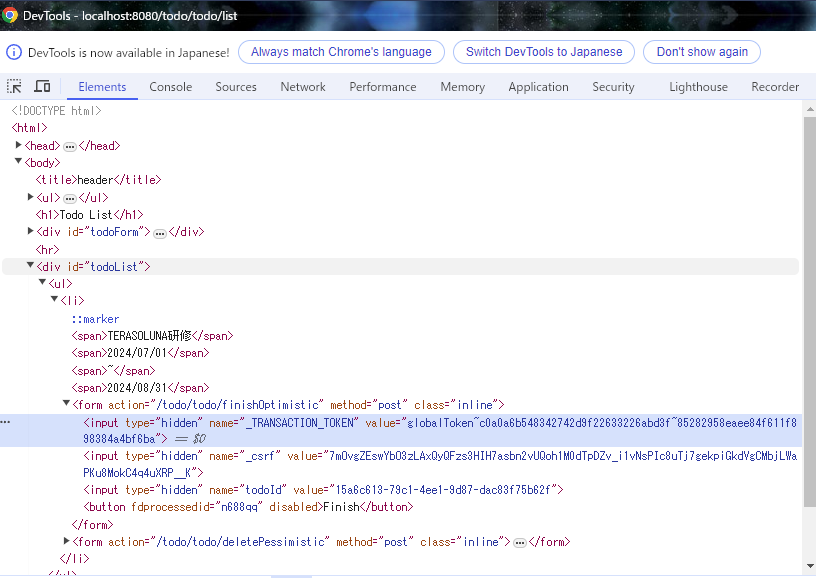

# todoサンプル拡張課題
## 二重送信防止
### 概要
Webアプリケーションにおいて、ボタンの二度押しなどにより更新系処理が意図せず複数回発生してしまうことがあります。  
例えば、ECサイトで商品を購入する際に決済処理が二重に行われてしまうなどの問題が発生してしまいます。

これを防ぐため、TERASOLUNAでは以下3つの二重送信防止策が推奨されています。
- JavaScriptによるボタンの2度押し防止
- PRG(Post-Redirect-Get)パターン
- トランザクショントークンチェック

#### JavaScriptによるボタンの2度押し防止
ボタンの二度押しによる二重送信を防ぐため、1回目のボタン押下によりリクエストが送信される前に、JavaScriptを使用してボタンを非活性にします。  
ボタンの非活性には、buttonタグにdisabled属性を付与します。

```html
<form action="/todo/create" method="post">
    ...
    <button disabled>Create Todo</button>
</form>
```

#### PRG(Post-Redirect-Get)パターン
POSTメソッドのリクエストに対して、直接Viewを返すのではなくGETメソッドにリダイレクトさせてViewを返す方法です。  
更新処理本体はPOSTメソッド側に実装し、画面表示のみをGETメソッドに実装することで、ユーザが画面をリロードしても更新処理は複数回実施されません。

```java
@Controller
@RequestMapping("todo")
public class TodoController {

    ...

    @PostMapping("create")
    public String create(TodoForm todoForm, RedirectAttributes attributes) {

        /* 更新処理 */

        return "redirect:/todo/list";
    }

    @GetMapping("list")
    public String list(Model model) {

        /* 画面表示処理 */

        return "todo/list";
    }
}
```

#### トランザクショントークンチェック
更新画面の初期表示時にランダムなトークン値を生成し、クライアントとサーバそれぞれに保持しておき、更新処理のタイミングで2つのトークン値を突き合わせることで不正なリクエストや意図しないリクエストではないことを確認する手法です。

チェックの実施には`@TransactionTokenCheck`アノテーションを使用します。

```java
@Controller
@RequestMapping("test")
// クラスに付与するアノテーションにはネームスペースを指定する
// Controllerクラスごとに異なる値を設定する場合が多い
// 詳細はガイドラインを参照
@TransactionTokenCheck("test")
public class TestController {

    @GetMapping("init")
    // 更新画面を表示するハンドラメソッドに付与するアノテーションには
    // トランザクションの開始を示すため、typeにBEGINを設定する
    // このメソッドから返却される画面にはhiddenでトークンが埋め込まれる
    @TransactionTokenCheck(type = TransactionTokenType.BEGIN)
    public String init(Model model) {
        ...
    }

    @PostMapping("update")
    // 更新処理をするハンドラメソッドに付与するアノテーションには
    // チェックを実施するため、typeにINを設定する
    // チェック後にトークン値は次の値に更新される
    @TransactionTokenCheck(type = TransactionTokenType.IN)
    public String update(TestForm form, Model model) {
        ...
    }

    @PostMapping("download")
    @ResponseStatus(HttpStatus.OK)
    // ファイルダウンロードなど、画面の再描画を挟まない場合は
    // サーバ型のトークン値を更新しても、画面に反映されないため
    // チェックのみ実施し、トークン値は更新しないようにtypeにCHECKを設定する
    @TransactionTokenCheck(type = TransactionTokenType.CHECK)
    public DownloadResponse download(TestForm form, Model model) {
        ...
    }
}
```

### 演習
二重送信防止を実装してみよう！

### 画面イメージ
- トランザクショントークンチェックエラー発生時

  

- Finishボタン非活性時

  

### 事前準備
1. [jquery-3.7.1.min.js](jquery-3.7.1.min.js)をそのまま`src/main/webapp/resources/vendor/js/jquery`フォルダに配置する

2. `src/main/webapp/resources/app/js/todo`フォルダに`list.js`を作成する

3. `list.html`にJavaScriptの読み込みを追加する
   ```html
   <head>
       <meta http-equiv="Content-Type" content="text/html; charset=UTF-8">
       <title th:text="#{title.todo.list}">Todo List</title>
       <link rel="stylesheet" href="../../../resources/app/css/styles.css" th:href="@{/resources/app/css/styles.css}">
       <script type="text/javascript" th:src="@{/resources/vendor/js/jquery/jquery-3.7.1.min.js}"></script>
       <script type="text/javascript" th:src="@{/resources/app/js/todo/list.js}"></script>
   </head>
   ```

### 進め方
1. TodoリストページのTODO作成、完了、削除処理でトランザクショントークンチェックが行われるように`TodoController.java`を修正する
2. TodoリストページのTODO作成、完了、削除処理ボタンを押下した際、ボタンが非活性になるように`list.js`の中身を実装する

### ポイント
- 3つの二重送信防止策のうち、PRG(Post-Redirect-Get)パターンはすでに適用されているため課題としては省略します  
  `TodoController.java`の実装とガイドラインを見て、どういった対策なのか確認してください
- JavaScriptによるボタンの2度押し防止についてはガイドラインに詳細が記載されていないので、自分でWeb検索して方法を調べてください  
  様々な方法がありますが、JQueryというJavaScriptライブラリを使った方法がシンプルです
- トランザクショントークンチェックが正しく行われているかは、以下の手順で試してみてください
   1. ブラウザでTODOリストページを開いた状態でF12キーを押下して開発者ツールを起動する
   2. 開発者ツールのElementsタブ（または要素タブ）でFinishボタンのあるformタグを開く
   3. `_TRANSACTION_TOKEN`という名前でhiddenのinputタグがあるので、valueを適当に編集する
   4. ブラウザに戻ってFinishボタンを押下する
   

### 参考
- [TERASOLUNAガイドライン - 4.6. 二重送信防止](https://terasolunaorg.github.io/guideline/current/ja/ArchitectureInDetail/WebApplicationDetail/DoubleSubmitProtection.html)
- [Zenn - 新人Webエンジニア必須？の知識「PRGパターン」について](https://zenn.dev/imah/articles/3d186a6462ecc8)