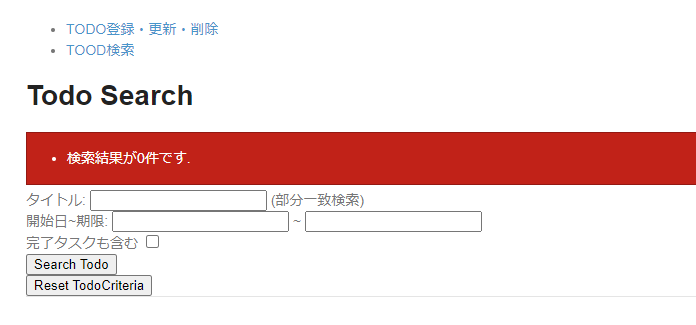

# todoサンプル拡張課題
## 例外ハンドリング
### 概要
WEBアプリケーション実行時に発生する例外は大きく3種類に分類されます。

1. ユーザの再操作(入力値の変更など)によって、発生原因が解消できる例外
2. ユーザの再操作によって、発生原因が解消できない例外
3. 不正なリクエストより発生する例外

上記、2と3はフレームワークによってハンドリングされるため、ここでは1のハンドリング方法について説明します。  
ユーザの再操作(入力値の変更など)によって、発生原因が解消できる例外はtry-catchまたは`@ExceptionHandler`アノテーションによりハンドリングします。

#### try-catch
メソッド単位で個別のハンドリングを行う場合は、Controllerクラスでtry-catchし、リクエスト単位で例外処理を行います。

```java
@Controller
@RequestMapping("todo")
public class TodoController {

    ...

    @PostMapping("test")
    public String create(TodoForm todoForm, RedirectAttributes attributes) {

        try {
            // 正常時の処理
        } catch (BusinessException e) {
            // 例外発生時の処理
        }
    }
}
```

#### `@ExceptionHandler`アノテーション
Controller単位で同一のハンドリングを行う場合は、`@ExceptionHandler`アノテーションを利用して例外処理を行います。  
`@ResponseStatus`アノテーションでクライアントに返却するHTTPステータスを変更できます。

```java
@Controller
@RequestMapping("todo")
public class TodoController {

    ...

    @PostMapping("test")
    public String create(TodoForm todoForm, RedirectAttributes attributes) {

        // 正常時の処理
    }

    @ExceptionHandler(BusinessException.class) //ハンドリングする例外を指定する
    @ResponseStatus(HttpStatus.CONFLICT) // この例の場合HTTPステータス409が返却される
    public ModelAndView handleBusinessException(BusinessException e) {

        // 例外発生時の処理

        ExtendedModelMap modelMap = new ExtendedModelMap();
        modelMap.addAttribute(e.getResultMessages());
        return new ModelAndView("todo/test", modelMap);
    }
}
```

### 演習
例外ハンドリングを追加しよう！

### 画面イメージ
- 検索結果0件の場合、エラーメッセージを表示
  

### 事前準備
1. `application-messages.properties`にメッセージを追加する

```properties
e.td.sc.8005=検索結果が0件です.
```

### 進め方
1. `TodoServiceImpl.java`で検索結果が0件だったときに`BusinessException`をスローするように追加する
2. `SearchController.java`で`@ExceptionHandler`アノテーションを用いてエラーハンドリングする
   その際、クライアントに返却するHTTPステータスは500とすること

### ポイント
- 実装完了した後、`BusinessException`をスローする箇所、ハンドリングする箇所それぞれにブレークポイントを設定してデバッグモードでサーバ起動し、処理をトレースしてみましょう
- 検索結果0件エラーだった際、検索条件は復元しなくて良いです

### 参考
- [TERASOLUNAガイドライン - 4.3. 例外ハンドリング](https://terasolunaorg.github.io/guideline/current/ja/ArchitectureInDetail/WebApplicationDetail/ExceptionHandling.html)
- [Qiita - 【初心者向け】Eclipseでのデバッグ方法](https://qiita.com/daikete/items/fb70e6e5808b433b9d85)