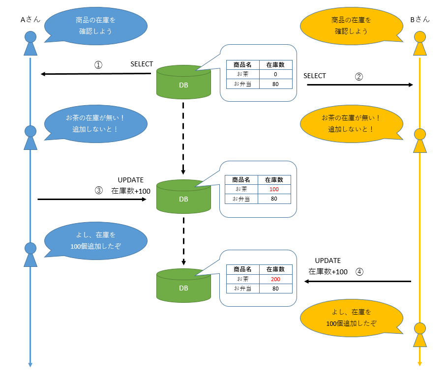
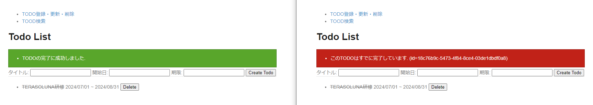
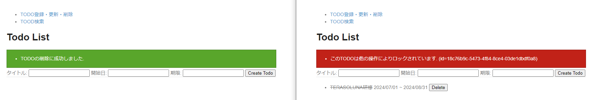

# todoサンプル拡張課題
## 排他制御
### 概要
1つのデータに対して複数ユーザが同時に更新をした場合、更新が重複して実施されたり、片方の更新が反映されなかったりとデータの整合性が保たれない可能性があります。  
以下が実際に発生する問題の例です。

  

1. Aさんがお茶の在庫を確認して、0個になっていることに気づく
2. Bさんもお茶の在庫が0個になっていることに気づく
3. Aさんが在庫を100個追加する
4. Bさんも在庫を100個追加する

この例ではAさんもBさんも在庫を100個補充しようと操作していますが、実際には200個になってしまいました。  
このような事態を防いでデータの整合性を保つ仕組みを排他制御と呼びます。

排他制御について説明する前に、まずはトランザクションについて改めて説明します。  
トランザクションとは、分割できない処理のあつまりです。詳しい説明は参考リンクを見てください。  
TERASOLUNAではこのトランザクションを管理する方法として、宣言型トランザクション管理が推奨されています。

基本的には`@Transactional`アノテーションが付与されたServiceクラスのメソッドが1トランザクションの単位になります。  
この1トランザクションの中でエラーが発生しなければコミット(更新結果が確定)され、エラーが発生した場合はロールバック(更新結果が取り消し)されます。

最初の例では、先に操作したAさんのトランザクションがコミットされ、後から操作したBさんのトランザクションがロールバックされれば、データの整合性が保たれます。  
この制御をデータベースのロック機能を使って実施する必要があります。  
データベースのロック機能にはいくつか種類がありますが、本研修ではその中でも悲観ロックと楽観ロックについて取り扱います。

まず、悲観ロックとは、更新対象のデータを取得する際にロックをかけ、他トランザクションから更新されないように制御する手法です。  
以下が悲観ロックのイメージ例です。


次に、楽観ロックとは、

悲観ロックと楽観ロックについて、それぞれの特徴をまとめたものが以下になります。


### 演習
悲観ロック、楽観ロックによる排他制御を行おう！

### 画面イメージ
- 2つのウインドウを開いて両方でFinishボタンを押下
  

- 2つのウインドウを開いて両方でDeleteボタンを押下
  

### 事前準備
1. `Todo.java`にフィールドを追加する
   ```java
   public class Todo implements Serializable {
       ...

       private long version;

       // Getter/Setterは省略
   }
   ```

2. `TodoRepository.java`にメソッドを3つ追加する
   ```java
   public interface TodoRepository {
       ...

       Todo findByIdForOptimistic(String todoId);

       boolean updateForOptimistic(Todo todo);

       Todo findByIdForPessimistic(String todoId);
   }
   ```

3. `TodoService.java`と`TodoServiceImpl.java`にメソッドを追加する
   ```java
   public interface TodoService {

       ...

       void finishOptimistic(String todoId);

       void deletePessimistic(String todoId);
   }
   ```

   ```java
   public class TodoServiceImpl implements TodoService {

       ...

       @Override
       public void finishOptimistic(String todoId) {
           Todo todo = todoRepository.findByIdForOptimistic(todoId);
           todo.setFinished(true);

           // ロック確認のため5秒停止
           try {
               Thread.sleep(5000);
           } catch(InterruptedException e) {
               throw new SystemException("e.xx.fw.9001", e);
           }

           if(!todoRepository.updateForOptimistic(todo)) {
               throw new OptimisticLockingFailureException("楽観ロックエラー");
           }
       }

       @Override
       public void deletePessimistic(String todoId) {
           Todo todo = todoRepository.findByIdForPessimistic(todoId);

           // ロック確認のため5秒停止
           try {
               Thread.sleep(5000);
           } catch(InterruptedException e) {
               throw new SystemException("e.xx.fw.9001", e);
           }

           todoRepository.delete(todo);
       }
   }
   ```

4. `TodoMapper.java`にアノテーションを追加する
   ```java
   @Mapper
   public interface TodoMapper {

       ...
       @Mapping(target = "version", ignore = true)
       Todo map(TodoForm form);
   }
   ```

5. `application-messages.properties`にメッセージを追加する
   ```properties
   # message
   ...
   e.td.sc.8004=このTODOは他の操作によりロックされています. (id={0})
   ```

6. `TodoController.java`にメソッドを追加する
   ```java
   @Controller
   @RequestMapping("todo")
   public class TodoController {

       ...

       @PostMapping("finishOptimistic")
       public String finishOptimistic(TodoForm form, Model model, RedirectAttributes attributes) {
           try {
               todoService.finishOptimistic(form.getTodoId());
           } catch (OptimisticLockingFailureException e) {
               model.addAttribute(ResultMessages.error()
                       .add(ResultMessage.fromCode("e.td.sc.8002", form.getTodoId())));
               return list(model);
           }
           attributes.addFlashAttribute(
                   ResultMessages.success().add(ResultMessage.fromCode("i.td.sc.0001")));
           return "redirect:/todo/list";
       }

       @PostMapping("deletePessimistic")
       public String deletePessimistic(TodoForm form, Model model, RedirectAttributes attributes) {
           try {
               todoService.deletePessimistic(form.getTodoId());
           } catch (PessimisticLockingFailureException e) {
               model.addAttribute(ResultMessages.error()
                       .add(ResultMessage.fromCode("e.td.sc.8004", form.getTodoId())));
               return list(model);
           }
           attributes.addFlashAttribute(
                   ResultMessages.success().add(ResultMessage.fromCode("i.td.sc.0002")));
           return "redirect:/todo/list";
       }
   }
   ```

7. `list.html`のFinish、Deleteボタンの遷移先(th:action)を変更する
   ```html
   <form th:if="${!todo.finished}" action="/todo/finish" th:action="@{/todo/finishOptimistic}" method="post"
       class="inline">
       <input type="hidden" name="todoId" th:value="${todo.todoId}" />
       <button>Finish</button>
   </form>
   <form action="/todo/delete" th:action="@{/todo/finishOptimistic}" method="post" class="inline">
       <input type="hidden" name="todoId" th:value="${todo.todoId}" />
       <button>Delete</button>
   </form>
   ```

### 進め方
1. `TodoRepository.xml`に以下3つのSQLを追加する
   - `findByIdForOptimistic`：楽観ロック用にVersionカラムを含むデータを取得する
   - `updateForOptimistic`：データの競合が無ければfinishedカラムを更新する
   - `findByIdForPessimistic`：悲観ロックを取得する

### ポイント
- 悲観ロックと楽観ロックの最大の違いは競合を制御するタイミングです  
  悲観ロックはデータの読み込み時にロックをかけ、書き込み時までそのロックを維持します  
  対して、楽観ロックはデータの読み込み時にはロックをかけず、書き込み時に競合をチェックします  

### 参考
- [TERASOLUNAガイドライン - 3.2. ドメイン層の実装 - 3.2.6. トランザクション管理について](https://terasolunaorg.github.io/guideline/current/ja/ImplementationAtEachLayer/DomainLayer.html#service-transaction-management)
- [TERASOLUNAガイドライン - 6.4. 排他制御](https://terasolunaorg.github.io/guideline/current/ja/ArchitectureInDetail/DataAccessDetail/ExclusionControl.html)
- [Qiita - 「トランザクション」とは何か？を超わかりやすく語ってみた！](https://qiita.com/zd6ir7/items/6568b6c3efc5d6a13865)
- [Qiita - データベースさわったこと無い新人向けトランザクション入門](https://qiita.com/komattio/items/838ea5df68eb076e8099)
