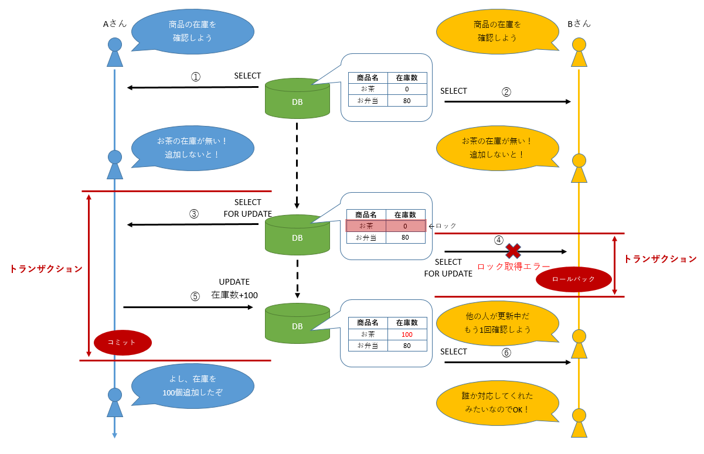
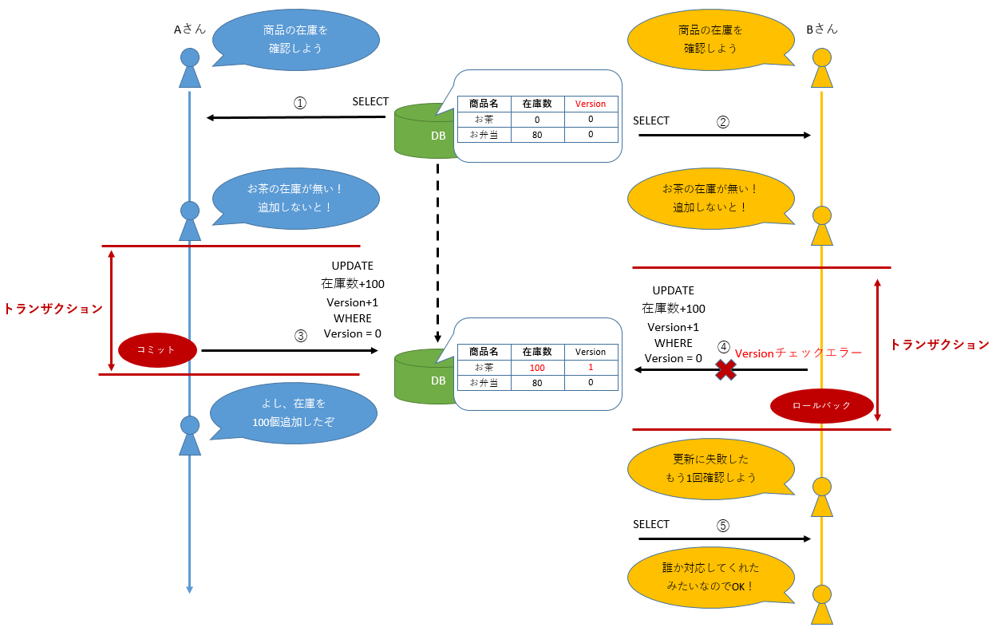

# todoサンプル拡張課題
## 排他制御
### 概要
1つのデータに対して複数ユーザが同時に更新をした場合、更新が重複して実施されたり、片方の更新が反映されなかったりとデータの整合性が保たれない可能性があります。  
以下が実際に発生する問題の例です。

  

1. Aさんがお茶の在庫を確認して、0個になっていることに気づく
2. Bさんもお茶の在庫が0個になっていることに気づく
3. Aさんが在庫を100個追加する
4. Bさんも在庫を100個追加する

この例ではAさんもBさんも在庫を100個補充しようと操作していますが、実際には200個になってしまいました。  
このような事態を防いでデータの整合性を保つ仕組みを排他制御と呼びます。

#### トランザクションについて
排他制御について説明する前に、まずはトランザクションについて改めて説明します。  
トランザクションとは、分割できない処理のあつまりです。詳しい説明は参考リンクを見てください。  
TERASOLUNAではこのトランザクションを管理する方法として、宣言型トランザクション管理が推奨されています。

基本的には`@Transactional`アノテーションが付与されたServiceクラスのメソッドが1トランザクションの単位になります。  
この1トランザクションの中でエラーが発生しなければコミット(更新結果が確定)され、エラーが発生した場合はロールバック(更新結果が取り消し)されます。

最初の例では、先に操作したAさんのトランザクションがコミットされ、後から操作したBさんのトランザクションがロールバックされれば、データの整合性が保たれます。  
この制御をデータベースのロック機能を使って実施する必要があります。  
データベースのロック機能にはいくつか種類がありますが、本研修ではその中でも悲観ロックと楽観ロックについて取り扱います。

#### 悲観ロック
悲観ロックとは、更新対象のデータを取得する際にロックをかけ、他トランザクションから更新されないように制御する手法です。  
以下が悲観ロックのイメージ例です。

  

1. Aさんがお茶の在庫を確認して、0個になっていることに気づく
2. Bさんもお茶の在庫が0個になっていることに気づく
3. Aさんがお茶のレコードに対してロックを取得する
4. Bさんもお茶のレコードに対してロックを取得しようとするが、すでにAさんがロック済みなのでエラーが発生し、トランザクションがロールバックされる
5. Aさんが在庫を100個追加し、トランザクションがコミットされてロックも解放される
6. Bさんは再度お茶の在庫を確認し、すでに100個追加されていたので何もしない

悲観ロックを使用するには、ロック取得のSELECT文の末尾に`FOR UPDATE`を追加します。  
以下のSQLを発行すると、SELECTの対象となったレコードにロックがかかります。

```sql
SELECT 在庫数
FROM 在庫
WHERE 商品名 = 'お茶'
FOR UPDATE
```

> [!IMPORTANT]  
> 冒頭の例はBさんのロック取得を即時エラーとする想定だが、ロックの解放を一定秒数待たせることもできる  
> データベース毎に機能の差があるため、一例として以下に示す。
> - `SELECT FOR UPDATE`：ロックが解放されるまで待つ
> - `SELECT FOR UPDATE NOWAIT`：解放を待たず即時エラーとする
> - `SELECT FOR UPDATE WAIT 5`：ロック開放を5秒間待ち、5秒経過するとエラーとする

#### 楽観ロック
楽観ロックとは、データに対するロックは行わず、データ取得から更新までの間に他トランザクションからの更新がないことを更新タイミングに確認する手法です。  
テーブルにVersionカラムを用意しておき、Versionカラムの値がデータ取得時から更新時まで変わっていなければ、他トランザクションからの更新がなかったと判断します。  
以下が楽観ロックのイメージ例です。

  

  1. Aさんがお茶の在庫を確認して、0個になっていることに気づく
  2. Bさんもお茶の在庫が0個になっていることに気づく
  3. Aさんが在庫を100個追加しようとし、Versionは取得時の0から変わっていないのでトランザクションがコミットされる  
  同時にVersionを+1する
  4. Bさんが在庫を100個追加しようとするが、Versionは取得時の0から1に変更されているので更新失敗し、トランザクションがロールバックされる
  5. Bさんは再度お茶の在庫を確認し、すでに100個追加されていたので何もしない

楽観ロックを使用するには、データ取得のSELECT文でVersionを取得し、データ更新のUPDATE文でWHERE句の条件にVersionが一致することを追加します。


```sql
SELECT 在庫数, Version
FROM 在庫
WHERE 商品名 = 'お茶'
```
```sql
UPDATE 在庫
SET 在庫数 = 在庫数 + 100,
    Version = Version + 1
WHERE 商品名 = 'お茶'
  AND Version = 0
```

#### それぞれの特徴
悲観ロックと楽観ロックについて、それぞれの特徴をまとめたものが以下になります。  
実際にプロジェクトでどの手法を採用するかは、機能ごとの仕様や性能要件によって検討されます。

|ロックの種類|特徴|適用ケース例|
|:---|:---|:---|
|悲観ロック|・データをロックするので、他トランザクションの更新によって処理が失敗することがなくなる<br>・ロック取得用のSELECT文を用意する必要がある|・データの取得から更新までが長時間かかる<br>・更新対象のデータが複数テーブルに分かれている<br>・バッチ処理とオンライン処理が同時に実行される|
|楽観ロック|・他トランザクションから先に更新されると処理が失敗する<br>・テーブルにVersionカラムを用意する必要がある|・データの取得から更新までが短時間で終わる<br>・他トランザクションによって更新されていた際に、更新内容を一度確認させたい|


### 演習
悲観ロック、楽観ロックによる排他制御を行おう！

### 画面イメージ
- 2つのウインドウを開いて両方でFinishボタンを押下
  

- 2つのウインドウを開いて両方でDeleteボタンを押下
  

### 事前準備
1. `Todo.java`、`TodoForm.java`にフィールドを追加する
   ```java
   public class Todo implements Serializable {
       ...

       private long version;

       // Getter/Setterは省略
   }
   ```

   ```java
   public class TodoForm implements Serializable {
       ...

       private long version;

       // Getter/Setterは省略
   }
   ```

2. `TodoRepository.java`にメソッドを2つ追加する
   ```java
   public interface TodoRepository {
       ...

       boolean updateForOptimistic(Todo todo);

       Todo findByIdForPessimistic(String todoId);
   }
   ```

3. `TodoService.java`と`TodoServiceImpl.java`にメソッドを追加する
   ```java
   public interface TodoService {

       ...

       void finishOptimistic(Todo todo);

       void deletePessimistic(String todoId);
   }
   ```

   ```java
   public class TodoServiceImpl implements TodoService {

       ...

       @Override
       public void finishOptimistic(Todo todo) {
           todo.setFinished(true);

           if(!todoRepository.updateForOptimistic(todo)) {
               throw new OptimisticLockingFailureException("楽観ロックエラー");
           }
       }

       @Override
       public void deletePessimistic(String todoId) {
           Todo todo = todoRepository.findByIdForPessimistic(todoId);

           // ロック確認のため5秒停止
           try {
               Thread.sleep(5000);
           } catch(InterruptedException e) {
               throw new SystemException("e.xx.fw.9001", e);
           }

           todoRepository.delete(todo);
       }
   }
   ```

5. `application-messages.properties`にメッセージを追加する
   ```properties
   # message
   ...
   e.td.sc.8004=このTODOは他の操作によりロックされています. (id={0})
   ```

6. `TodoController.java`にメソッドを追加する
   ```java
   @Controller
   @RequestMapping("todo")
   public class TodoController {

       ...

       @PostMapping("finishOptimistic")
       public String finishOptimistic(TodoForm form, Model model, RedirectAttributes attributes) {

           Todo todo = beanMapper.map(form);

           try {
               todoService.finishOptimistic(todo);
           } catch (OptimisticLockingFailureException e) {
               model.addAttribute(ResultMessages.error()
                       .add(ResultMessage.fromCode("e.td.sc.8002", form.getTodoId())));
               return list(model);
           }
           attributes.addFlashAttribute(
                   ResultMessages.success().add(ResultMessage.fromCode("i.td.sc.0001")));
           return "redirect:/todo/list";
       }

       @PostMapping("deletePessimistic")
       public String deletePessimistic(TodoForm form, Model model, RedirectAttributes attributes) {
           try {
               todoService.deletePessimistic(form.getTodoId());
           } catch (PessimisticLockingFailureException e) {
               model.addAttribute(ResultMessages.error()
                       .add(ResultMessage.fromCode("e.td.sc.8004", form.getTodoId())));
               return list(model);
           }
           attributes.addFlashAttribute(
                   ResultMessages.success().add(ResultMessage.fromCode("i.td.sc.0002")));
           return "redirect:/todo/list";
       }
   }
   ```

7. `list.html`のFinish、Deleteボタンの遷移先(th:action)を変更する  
Finishのformにはhiddenでversionを追加する
   ```html
   <form th:if="${!todo.finished}" action="/todo/finish" th:action="@{/todo/finishOptimistic}" method="post"
       class="inline">
       <input type="hidden" name="todoId" th:value="${todo.todoId}" />
       <input type="hidden" name="version" th:value="${todo.version}" />
       <button>Finish</button>
   </form>
   <form action="/todo/delete" th:action="@{/todo/finishOptimistic}" method="post" class="inline">
       <input type="hidden" name="todoId" th:value="${todo.todoId}" />
       <button>Delete</button>
   </form>
   ```

### 進め方
1. TODOの登録、取得でversionを取り扱えるように`TodoRepository.xml`で`create`、`findAll`のSQLを修正する
2. `TodoRepository.xml`に以下2つのSQLを追加する
   - `updateForOptimistic`：楽観ロックによるデータの競合を確認し、競合が無ければfinishedカラムを更新する
   - `findByIdForPessimistic`：悲観ロックを取得する

### ポイント
- 悲観ロックと楽観ロックの最大の違いは競合を制御するタイミングです  
  悲観ロックはデータの読み込み時にロックをかけ、書き込み時までそのロックを維持します  
  対して、楽観ロックはデータの読み込み時にはロックをかけず、書き込み時に競合をチェックします  

### 参考
- [TERASOLUNAガイドライン - 3.2. ドメイン層の実装 - 3.2.6. トランザクション管理について](https://terasolunaorg.github.io/guideline/current/ja/ImplementationAtEachLayer/DomainLayer.html#service-transaction-management)
- [TERASOLUNAガイドライン - 6.4. 排他制御](https://terasolunaorg.github.io/guideline/current/ja/ArchitectureInDetail/DataAccessDetail/ExclusionControl.html)
- [Qiita - 「トランザクション」とは何か？を超わかりやすく語ってみた！](https://qiita.com/zd6ir7/items/6568b6c3efc5d6a13865)
- [Qiita - データベースさわったこと無い新人向けトランザクション入門](https://qiita.com/komattio/items/838ea5df68eb076e8099)
