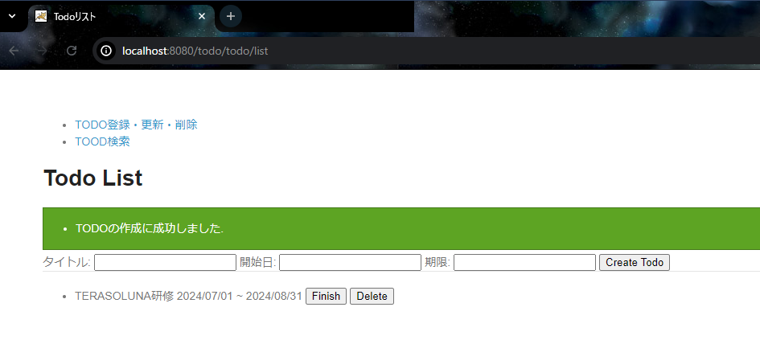
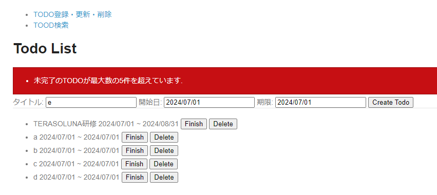

# todoサンプル拡張課題
## メッセージ管理
### 概要
メッセージをプロパティで管理するようにしよう！

### 画面イメージ
- ページタイトルとTODO作成時のメッセージをプロパティから取得した結果
  

- TODO作成数が上限を超えた際のエラーメッセージをプロパティから取得した結果
  

### 事前準備
1. `ApplicationContextConfig.java`内で`MessageSource`がBean定義されていることを確認する
> [!IMPORTANT]  
> ガイドラインの「4.7.2.1.1. プロパティを使用する際の設定」はXMLで書かれているが、ここで確認したBean定義が同等のものとなる

2. `application-messages.properties`に以下を追加する
   ```properties
   # title
   title.todo.list=Todoリスト
   title.search.search=Todo検索
   
   # label
   label.td.todo.todoTitle=タイトル:
   label.td.todo.startDate=開始日:
   label.td.todo.limitDate=期限:
   label.td.search.todoTitle=タイトル:
   label.td.search.todoTitle.annotation=(部分一致検索)
   label.td.search.date=開始日~期限:
   label.td.search.finished=完了タスクも含む
   
   # resultMessage
   i.td.td.0000=TODOの作成に成功しました.
   i.td.td.0001=TODOの完了に成功しました.
   i.td.td.0002=TODOの削除に成功しました.
   e.td.td.8000=未完了のTODOが最大数の{0}件を超えています.
   e.td.td.8001=開始日が期限より後になっています.
   e.td.td.8002=このTODOはすでに完了しています. (id={0})
   e.td.td.8003=対象のTODOが見つかりませんでした. (id={0})
   ```

### 進め方
1. プロパティファイルに設定したタイトル、ラベルが画面に表示されるように修正する
2. プロパティファイルに設定した結果メッセージが画面に表示されるように修正する

### ポイント
- タイトルやラベルはプロジェクトの方針次第ではHTMLに直接記載することもありますが、プロパティファイルに設定することで表記ゆれを防いだり、変更する際の工数削減・変更漏れ対策として有効です

### 参考
- https://terasolunaorg.github.io/guideline/current/ja/ArchitectureInDetail/WebApplicationDetail/MessageManagement.html