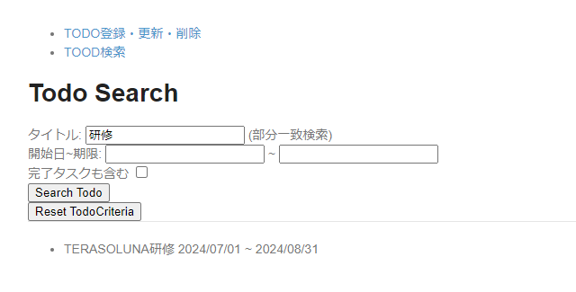

# todoサンプル拡張課題
## セッション管理
### 概要


### 演習
検索条件をセッションに保持してみよう！

### 画面イメージ
- 検索条件のリセットボタンを追加

  

### 事前準備
1. `com.example.todo.app.search`パッケージに`SessionTodoCriteria.java`を作成する
   ```java
   package com.example.todo.app.search;

   import java.io.Serializable;
   import org.springframework.context.annotation.Scope;
   import org.springframework.context.annotation.ScopedProxyMode;
   import org.springframework.stereotype.Component;
   import com.example.todo.domain.repository.todo.TodoCriteria;

   @Component
   @Scope(value = "session", proxyMode = ScopedProxyMode.TARGET_CLASS)
   public class SessionTodoCriteria implements Serializable {

       private static final long serialVersionUID = 1L;

       private TodoCriteria criteria;

       private boolean setFlg;

       public TodoCriteria getCriteria() {
           if (criteria == null) {
               criteria = new TodoCriteria();
           }
           return criteria;
       }

       public void setCriteria(TodoCriteria criteria) {
           setFlg = true;
           this.criteria = criteria;
       }

       public boolean isSetFlg() {
           return setFlg;
       }

       public void clearCriteria() {
           criteria = null;
           setFlg = false;
       }
   }
   ```

2. `SearchMapper.java`のメソッド名の変更(map ⇒ mapForm2Criteria)とメソッド追加(mapCriteria2Form)を行う
   ```java
   @Mapper
   public interface SearchMapper {

       TodoCriteria mapForm2Criteria(SearchForm form);

       SearchForm mapCriteria2Form(TodoCriteria criteria);
   }
   ```

3. `SearchController.java`にメソッドを追加する
   ```java
   @Controller
   @RequestMapping("search")
   public class SearchController {
       ...

       @GetMapping("reset")
       public String reset() {
           return "search/search";
       }
   }
   ```

4. `search.html`に検索条件のリセットFormを追加する
   ```html
   <body>
       ...
       <div id="searchForm">
           ...
           <form action="/search" th:action="@{/search}" method="post" th:object="${searchForm}">
               ...
           </form>
           <form th:action="@{search/reset}" method="get">
               <button>Reset TodoCriteria</button>
           </form>
   ```

### 進め方
1. 検索画面の初期表示時、検索条件がセッションに登録されていれば検索を実施する
2. 検索時、検索条件をセッションに登録する
3. 検索条件のリセット時、セッションに登録された検索条件をクリアする

### ポイント
- セッションの保持には「Spring FrameworkのsessionスコープのBean」を利用してください
- 検索画面の初期表示で検索を実施する際、画面上のFormにも検索条件が復元されるようにしてください

### 参考
- [TERASOLUNAガイドライン - 4.4. セッション管理](https://terasolunaorg.github.io/guideline/current/ja/ArchitectureInDetail/WebApplicationDetail/SessionManagement.html)
