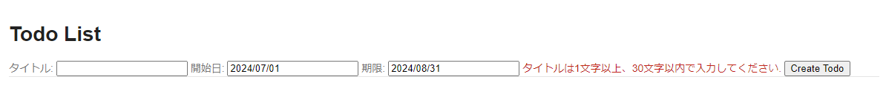
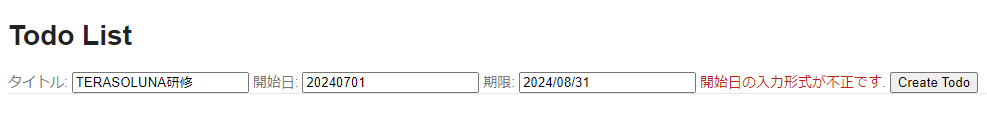
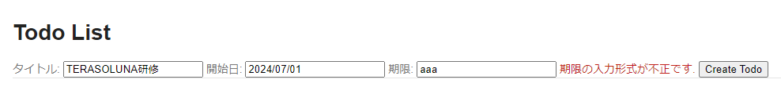

# todoサンプル拡張課題
## 入力チェック(単項目チェック)
### 概要
ユーザが入力した値の長さや形式が妥当か検証する機能のことを入力チェックと呼びます。  
パラメータとして想定していない値を機能に渡してしまうと、意図しない挙動やエラーが発生してしまうので、ユーザに再入力を促す必要があります。  

入力チェックは単項目チェック、相関項目チェックに分かれますが、ここでは単項目チェックについて取り扱います。

|種類|説明|例|
|:---|:---|:---|
|単項目チェック|単一のフィールドで完結するチェック|<span style="color:red">アカウント名は必須項目です</span><br><label>アカウント名：</label><input type="text">|
|相関項目チェック|複数のフィールドを比較するチェック|<span style="color:red">パスワードが一致しません</span><br><label>パスワード：</label><input type="password"><br><label>パスワードの確認：</label><input type="password">|

単項目チェックはフォームクラスの各フィールドにアノテーションを付与することで行われます。  
他にどのようなアノテーションがあるかはガイドラインのAppendixを確認してみてください。
```java
public class UserForm implements Serializable {

    @NotNull // 必須入力
    @Size(min = 1, max = 20) // 1文字以上、20文字以下
    private String name;

    @Email //hoge@fuga.comのようなメールアドレス形式
    private String email;

    @Min(0) // 0以上
    @Max(200) // 200以下
    private Integer age;

    ...
}
```

次に、チェックエラーが発生した際の制御をControllerクラスに実装します。
```java
@Controller
@RequestMapping("user")
public class UserController {

    ...

    @PostMapping("create")
    // 入力チェックを実施したいformには@Validatedアノテーションを付与し、
    // エラー情報が格納されるBindingResultを必ず"formの直後の引数"に指定する
    public String createUser(@Validated UserForm userForm, BindingResult result) {
        // チェックエラーが発生した場合、result.hasErrors()がtrueになる
        if(result.hasErrors()) {
            // チェックエラーがあったので元の画面に戻す
            return "user/createForm";
        }
        // チェックエラーがなければ次画面に進む
        return "user/createConfirm";
    }

    ...

}

```

最後にエラー内容を画面に出力させます。  
具体的なメッセージの文言やどこにエラー文を表示させるかは実際のプロジェクトや画面ごとに異なるので以下は一例です。
```html
<html xmlns:th="http://www.thymeleaf.org">
<body>
  <form th:action="@{/user/create}" method="post">
    <span th:errors="${userForm.name}"></span>
    <br>
    <label for="name">名前:</label>
    <input type="text" th:field="${userForm.name}">
    <br>
    <span th:errors="${userForm.email}"></span>
    <br>
    <label for="name">メールアドレス:</label>
    <input type="text" th:field="${userForm.email}">
    <br>
    <span th:errors="${userForm.age}"></span>
    <br>
    <label for="age">年齢:</label>
    <input type="text" th:field="${userForm.age}">
  </form>
</body>
</html>
```

<span style="color:red">名前を入力してください</span>
<br>
<label for="name">名前:</label>
<input id="name" type="text">
<br>
<span style="color:red">メールアドレス形式で入力してください</span>
<br>
<label for="email">メールアドレス:</label>
<input id="email" type="text" value="aaaaa">
<br>
<span style="color:red">0以上、200以下で入力してください</span>
<br>
<label for="age">年齢:</label>
<input id="age" type="text" value="201">


### 演習
開始日、期限に入力チェックを追加しよう！

### 画面イメージ
- タイトルが未入力の場合のエラーメッセージ
  
- 開始日が`uuuu/MM/dd`形式以外の場合のエラーメッセージ
  
- 期限に日付以外の文字列が入力された場合のエラーメッセージ
  

### 事前準備
1. `ApplicationContextConfig.java`のmessageSourceメソッドに文字コード`UTF-8`を指定する1行を追加する
   ```java
   @Configuration
   @EnableAspectJAutoProxy
   @Import({ TodoDomainConfig.class })
   public class ApplicationContextConfig {
      ...
      @Bean("messageSource")
      public MessageSource messageSource() {
          ResourceBundleMessageSource bean = new ResourceBundleMessageSource();
          bean.setBasenames("i18n/application-messages");
          bean.setDefaultEncoding("UTF-8");
      }
      ...
   }
   ```

2. `list.html`に開始日、期限のエラーメッセージ出力箇所を追加する
   - 入力項目
   ```html
   <form action="/todo/create" th:action="@{/todo/create}" method="post">
       <label>タイトル:</label>
       <input type="text" th:field="${todoForm.todoTitle}" />
       <label>開始日:</label>
       <input type="text" th:field="${todoForm.startDate}" />
       <label>期限:</label>
       <input type="text" th:field="${todoForm.limitDate}" />
       <span id="todoTitle.errors" th:errors="${todoForm.todoTitle}" class="text-error">size must be between 1 and 30</span>
       <span id="startDate.errors" th:errors="${todoForm.startDate}" class="text-error"></span>
       <span id="limitDate.errors" th:errors="${todoForm.limitDate}" class="text-error"></span>
       <button>Create Todo</button>
   </form>
   ```

### 進め方
1. タイトルが1文字以上、30文字以内ではない場合のエラーメッセージを以下に変更する
   > タイトルは1文字以上、30文字以内で入力してください.
2. 開始日が「数字4桁/数字4桁/数字2桁」の形式ではない場合のバリデーションを追加し、メッセージは以下とする
   > 開始日の入力形式が不正です.
3. 期限が未入力の場合のバリデーションを追加し、メッセージは以下とする
   > 期限は必須項目です.
4. 期限に日付以外の文字列が入力された場合のバリデーションを追加し、メッセージは以下とする
   > 期限の入力形式が不正です.

### ポイント
- メッセージは`application-messages.properties`と`ValidationMessages.properties`の2ファイルに定義します  
- `ValidationMessages.properties`にはフォームクラスの各フィールドに付与したアノテーションに対応するデフォルトメッセージを定義します
  ```properteis
  # 「アノテーションのFQCN.message」の形式でキーを指定する
  jakarta.validation.constraints.NotNull.message = {0}は必須項目です.
  ```
- `application-messages.properties`には上で定義したメッセージの`{0}`部分に入るフィールド名や型のミスマッチが発生した際のメッセージを定義します
  ```properties
  # フォームクラスのフィールド名をキーに、エラー文に埋め込みたい文字を指定する
  name=名前
  email=メールアドレス
  age=年齢

  # フォームクラスではInteger型で定義しているフィールドに対して、数字以外の文字が入力された場合に表示されるメッセージ
  typeMismatch.java.lang.Integer={0}には数字を入力してください.
  ```
- 「タイトル」、「開始日」などのフィールド名や「0」、「30」といったアノテーションの属性値をメッセージにべた書きしてしまうと汎用性が損なわれてしまうため避けましょう

### 参考
- [TERASOLUNAガイドライン - 4.2. 入力チェック](https://terasolunaorg.github.io/guideline/current/ja/ArchitectureInDetail/WebApplicationDetail/Validation.html)
